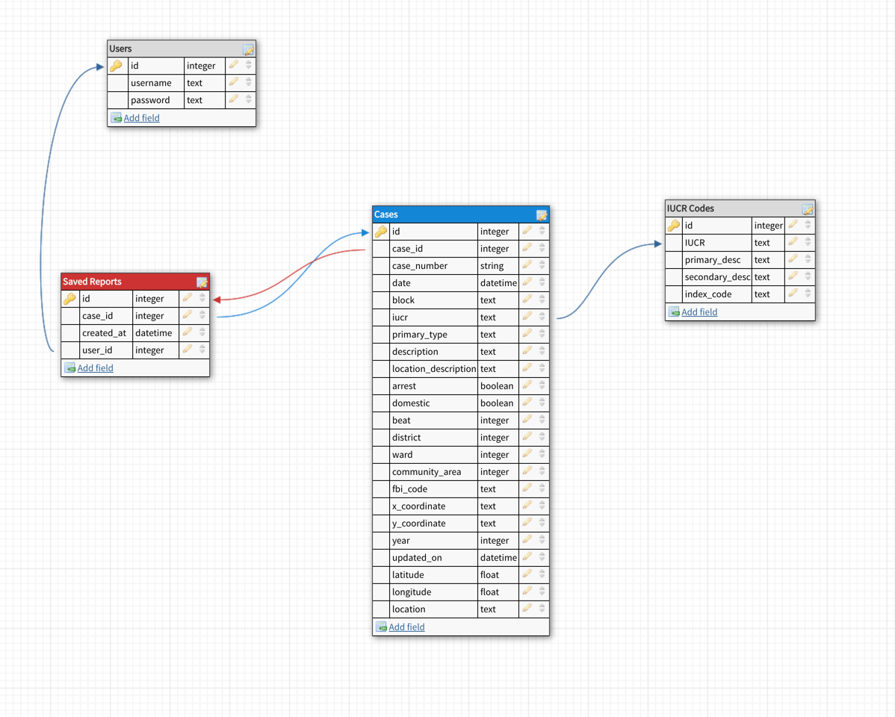

# Harvard Crime App
The Harvard Crime App is a data driven web application that leverages predictive models
and charts to visualize Chicago, Illinois crime data. Within the Harvard Crime App, users will
be able to create a profile and save custom reports to create specific datasets to visualize.
In addition, users will be able to report a crime by filling out a simple form and and monitor
the progress and status of the crime. Given that we don't want to send fake crime reports off
to the Chicago Police Department, this form will simply create the crime reported in the database
and not actually inform any authorities.

## Pages and Routes

#### Signup (/signup)
The Sign Up route will serve as our main user onboarding page. The signup route will allow
users to create an account which will enable them to save custom reports to their profile.
A user will consist of an **email**, **username**, and **password**.

#### Login (/login)
A login page will be provided for users to login and authenticate with the server. The SHA256
Cryptographic Hash Algorithm will be used to authenticate the user input with credentials stored
in the database.

#### Logout (/logout)
Functionality to logout from the application will be provided. Once logged out, the session
will be cleared of all user-specific data.

#### Main/Home (/home)
The home page will act as the main focal point of the Crime App. Within the landing page, users
will be able to analyze data by providing filters to narrow down the data in order to find what
they are looking for. Users will have the option to save these filters into a custom report for
use later. This will enable users to easily compile reports they are interested in and be able
to view those reports without having to re-enter filters every time.

Aside from viewing visualized data, users will also be able to download the dataset in its raw
form for usage outside of the application. Supported formats will be JSON and csv.

Additional features to complement the user experience will be the ability to view a live twitter
feed of the Chicago Police Department as well as report a crime directly (faked, as described above).

The data in which we will provide visualizations on will be for Crime Type, Crimes by Area, and
Crime Frequency.

 ##### Visualizations
 - Crime Type: Bar Chart showing the breakdown of crimes by type
 - Crimes by Area: Bar Chart showing the breakdown of crimes by district
 - Crime Frequency: Time Series chart showing crimes and how frequent they occur

#### Forecasting (/forecasting)
Within the Crime App, a user may want to see a more predictive visualization based on crime trends.
A page will be provided to show a predictive visualization of crimes to be reported in the future.

#### Profile (/profile)
During the lifespan of a user visit to the application, there will be an available page for a user
to manage their profile which includes saved reports and crimes that were reported by the user. This
page will be secure, meaning that access to the page is restricted to the users data and not others.

## Members and Contributors
The creators and owners of the application are Kristen, Clair and Marc. The division of labor for 
the development cycle is as follows:

* **Claire**: Responsible for the front end development. This includes creating HTML templates, styles,
design and the creation of D3 charts.
* **Kristen**: Responsible for the predictive modeling (forecasting). The scope of the predictive modeling
will cover the creation of the ipython notebook, cleansing of data and generating the pickle file
for importing the data into the database
* **Marc**: Responsible for creating the database and models. The database scope includes creating the
python scripts to import data into the database, creating the database, creating models, building the
database relationships and building out database queries

Essentially, we have broken down the tasks to create the application in a manner where we can work in
parallel covering data science, front end and backend areas. We have full expectations that we will
all be helping each other out and working together as a team to reach our final goal of projection
completion.

## Data Sources / References

- [Main Data Set: Chicago Crimes - 2001 to Present](https://catalog.data.gov/dataset/crimes-2001-to-present-398a4)
- [Chicago IUCR Codes](https://data.cityofchicago.org/widgets/c7ck-438e)

## Process Book

| Complete | Task                          | Description                                                                     | Estimate |
|----------|-------------------------------|---------------------------------------------------------------------------------|----------|
|   [X]    | Create DB                     | Create the database in Heroku (PostgreSQL)                                      | 1        |
|   [X]    | Create cases table            | Create the main table which will hold the raw data of Chicago crimes            | 1        |
|   [X]    | Acquire IUCR Data             | Obtain the data for IUCR codes just in case we need it                          | 1        |
|   [X]    | Create predictive model       | Create a predictive model that predicts amount of crimes to happen in future    | 15       |
|   [X]    | Create exploration notebook   | Create an exploratory notebook to explore data                                  | 5        |
|   [X]    | Create ERD for Crimes         | Create database diagram for crimes table                                        | 2        |
|   [X]    | Create GitHub repo            | Create the GitHub Repo                                                          | 1        |
|   [X]    | Import Crimes Data            | Import crime cases into cases table                                             | 5        |
|   [X]    | Create Data Import Script     | Create Python script to import data from csv into postgresql                    | 1        |
|   [X]    | Create users table            | Create the users table to store users                                           | 1        |
|   [X]    | Create saved reports table    | Create the table which will store saved reports                                 | 1        |
|   [X]    | Create models for tables      | Create models for User, Case, Report                                            | 2        |
|   [X]    | Connect Database to Flask     | Create the connectivity between the flask app and the heroku db                 | 1        |
|   [X]    | Create db queries             | Create the necessary database queries for the app                               | 3        |
|   [X]    | Create project                | Create the project structure and repository for the app.(GitHub/Heroku)         | 2        |
|   [X]    | Sign up route                 | Create sign up route                                                            | 1        |
|   [X]    | Sign up page                  | Create the html template, style and design for login page                       | 2        |
|   [X]    | Logout route                  | Create the logout route                                                         | 1        |
|   [X]    | Login route                   | Create the login route                                                          | 1        |
|   [X]    | Login Page                    | Create login form/page                                                          | 2        |
|   [X]    | Main route                    | Create the main route (/home)                                                   | 2        |
|   [X]    | Crime Type JSON endpoint      | Create endpoint to return crime types in json format (for visualization)        | 3        |
|   [X]    | Crime by Area JSON endpoint   | Create endpoint to return crimes by area in json format (for visualization)     | 4        |
|   [X]    | Crime frequency JSON endpoint | Create endpoint to return frequency of crime in json format (for visualization) | 4        |
|   [X]    | Crime Type D3 Viz             | Create d3 visualization of crime types                                          | 5        |
|   [X]    | Crime by Area D3 Viz          | Create d3 visualization of crime by area                                        | 10       |
|   [X]    | Create filters for dashboard  | Create filters for the visualizations in the main route                         | 10       |
|   [X]    | Create Forecasting route      | Create the route for forecasting                                                | 1        |
|   [X]    | Create Forecasting page       | Create the html, css, and js for forecasting page                               | 5        |    | 5        |

#### Project Milestone 1 (12/3/2018)
At the end of the first milestone, we were able to acquire the data for Chicago Crimes from 2001 - present. Data is still being uploaded
as it's a long process since there are over 6 million records. Although there is still data to upload, we are not blocked by any lack of
data as the python notebooks for the exploration, cleansing and formatting were done through the CSV.

In addition, we were able to create basic forecasting models for predicting the amount of crimes that will happen in the future. We were
also able to get a much better understanding on our target visualizations and how we will model them.

#### Project Milestone 2 (12/10/2018)
The second milestone was very productive. We were able to get our design defined, our endpoints and routes created and
get the front end up and running. This milestone a lot of progress was made around getting the visualizations implemented
and developing what we need for the saved reports and filtering. In addition, we implemented signup and login/logout
features to get us ready to start saving user-specific data.

Currently, the application is visualizing the 3 core features we were after. You are able to filter on the data but
not able to save the report quite yet. We want to make sure we are good on the way we are applying filters before writing
it to the database.

Next week, we will finish up our application by cleaning up the current main page, finish implementing the saved reports
functionality and wrap things up with the forecast page.

#### Closing Notes (12/16/2018)
We were able to to create a predictive model for forcasting and displaty a bar chart of predicted number of crimes to happend 
in 2019. We were able to deliver features that enables the user save a custom report, view case
details including the exact location of the crime rendered via google maps api and create visualizations
that display the crime breakdowns in Chicago.